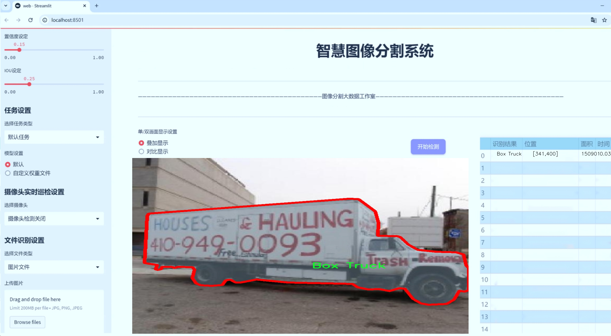
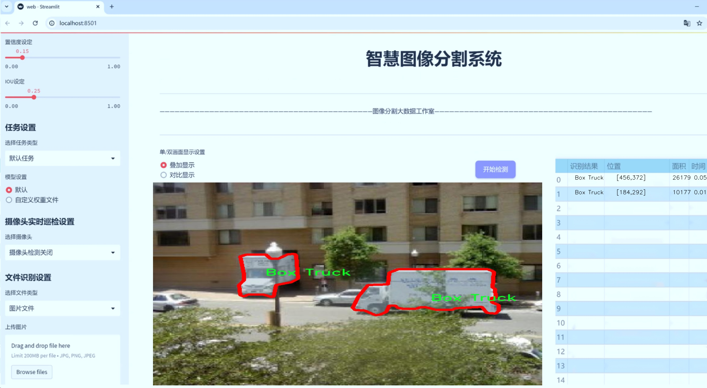
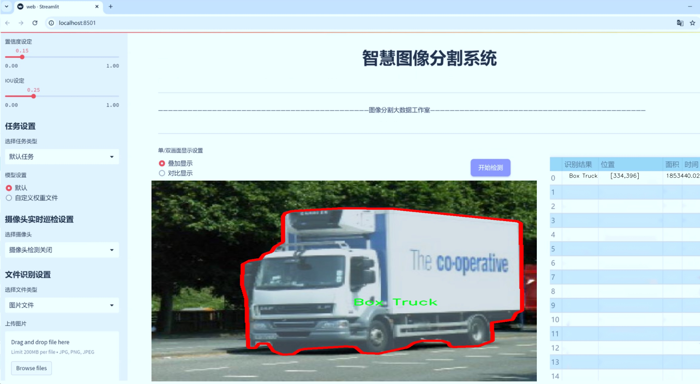
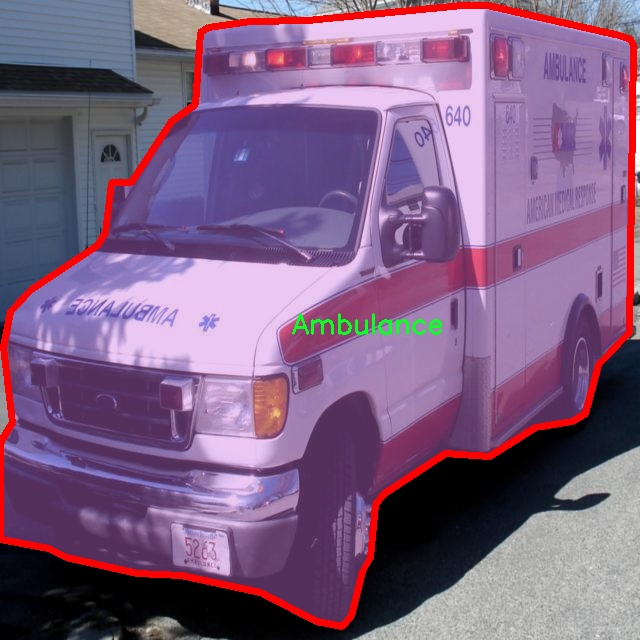
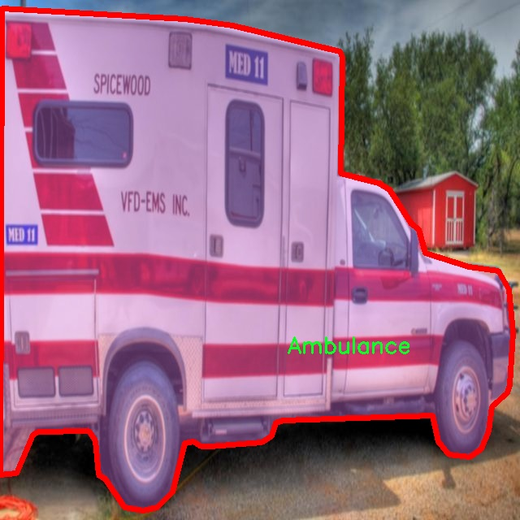
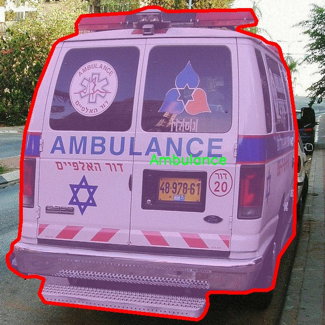
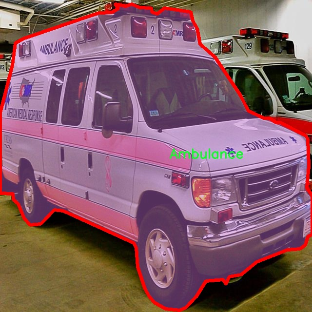
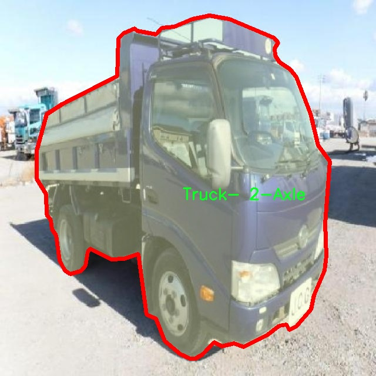

# 车辆类型图像分割系统源码＆数据集分享
 [yolov8-seg＆yolov8-seg-C2f-RFCAConv等50+全套改进创新点发刊_一键训练教程_Web前端展示]

### 1.研究背景与意义

项目参考[ILSVRC ImageNet Large Scale Visual Recognition Challenge](https://gitee.com/YOLOv8_YOLOv11_Segmentation_Studio/projects)

项目来源[AAAI Global Al lnnovation Contest](https://kdocs.cn/l/cszuIiCKVNis)

研究背景与意义

随着城市化进程的加快，交通管理与车辆监控已成为现代城市治理的重要组成部分。车辆类型的准确识别与分类不仅有助于交通流量的优化管理，还能为城市规划、环境保护及安全监控提供重要的数据支持。传统的车辆识别方法多依赖于人工标注和简单的图像处理技术，效率低下且准确性不足，难以满足日益增长的交通管理需求。因此，基于深度学习的图像分割技术，尤其是YOLO（You Only Look Once）系列模型的应用，成为了研究的热点。

YOLOv8作为YOLO系列的最新版本，具有更高的准确性和实时性，适合于复杂的交通场景下进行车辆检测与分类。通过改进YOLOv8模型，我们可以在图像分割的基础上实现对不同类型车辆的精准识别。本文所采用的数据集“Vehicle Classification V2”包含3700张图像，涵盖21种不同类型的车辆，如救护车、垃圾车、公交车等，具有丰富的类别信息。这为研究提供了良好的基础，使得模型能够在多样化的场景中进行训练和测试。

在当前的研究中，车辆类型的图像分割不仅仅是识别车辆的任务，更是对车辆进行精细化分类的重要手段。通过对图像进行分割，可以更好地提取车辆的特征，进而提高分类的准确性。此外，图像分割技术能够有效处理遮挡、光照变化等复杂情况，使得模型在实际应用中具备更强的鲁棒性。改进YOLOv8的车辆类型图像分割系统，不仅可以提升车辆识别的效率，还能为智能交通系统的构建提供技术支持。

本研究的意义在于，通过对YOLOv8模型的改进，探索更高效的车辆类型识别方法，推动智能交通领域的发展。具体而言，改进后的模型能够在多种复杂环境下实现对车辆的实时检测与分类，为交通管理部门提供及时、准确的数据支持。此外，随着自动驾驶技术的不断发展，车辆类型的准确识别将成为自动驾驶系统安全性的关键因素之一。因此，本研究不仅具有理论价值，也具有广泛的应用前景。

综上所述，基于改进YOLOv8的车辆类型图像分割系统的研究，旨在通过深度学习技术提升车辆识别的准确性与效率，推动智能交通系统的建设，为城市交通管理提供科学依据。这一研究不仅有助于解决当前交通管理中的实际问题，也为未来的智能交通技术发展奠定了基础。

### 2.图片演示







##### 注意：由于此博客编辑较早，上面“2.图片演示”和“3.视频演示”展示的系统图片或者视频可能为老版本，新版本在老版本的基础上升级如下：（实际效果以升级的新版本为准）

  （1）适配了YOLOV8的“目标检测”模型和“实例分割”模型，通过加载相应的权重（.pt）文件即可自适应加载模型。

  （2）支持“图片识别”、“视频识别”、“摄像头实时识别”三种识别模式。

  （3）支持“图片识别”、“视频识别”、“摄像头实时识别”三种识别结果保存导出，解决手动导出（容易卡顿出现爆内存）存在的问题，识别完自动保存结果并导出到tempDir中。

  （4）支持Web前端系统中的标题、背景图等自定义修改，后面提供修改教程。

  另外本项目提供训练的数据集和训练教程,暂不提供权重文件（best.pt）,需要您按照教程进行训练后实现图片演示和Web前端界面演示的效果。

### 3.视频演示

[3.1 视频演示](https://www.bilibili.com/video/BV1JuyPYbER4/)

### 4.数据集信息展示

##### 4.1 本项目数据集详细数据（类别数＆类别名）

nc: 21
names: ['Ambulance', 'Box Truck', 'Bus', 'Bus- Small', 'Concrete Mixer', 'Construction Equipment', 'Cyclist', 'Fire Truck', 'Garbage Truck', 'Hatchback', 'Motorbike', 'Pickup', 'Pickup- Utility', 'SUV', 'Sedan', 'Tow Truck', 'Tractor Trailer', 'Trailer', 'Truck- 2-Axle', 'Truck- Multi-Axle', 'Van']


##### 4.2 本项目数据集信息介绍

数据集信息展示

在现代智能交通系统的研究与应用中，车辆类型的准确识别与分割是至关重要的。为此，我们采用了名为“Vehicle Classification V2”的数据集，以支持对YOLOv8-seg模型的训练和优化，旨在提升车辆类型图像分割系统的性能。该数据集包含21个不同的车辆类别，涵盖了从紧凑型轿车到大型货车的多种车辆类型，具体类别包括：救护车、箱式货车、公共汽车、小型公共汽车、混凝土搅拌车、建筑设备、骑自行车者、消防车、垃圾车、掀背车、摩托车、皮卡车、实用型皮卡、运动型多用途车（SUV）、轿车、拖车、拖车、两轴卡车、多轴卡车和厢式货车等。

数据集的多样性使其在训练过程中能够有效地覆盖不同的车辆特征和外观，增强模型的泛化能力。每个类别的车辆在数据集中都包含了大量的标注图像，这些图像不仅展示了车辆的外观，还涵盖了不同的拍摄角度、光照条件和背景环境。这种丰富的图像样本为YOLOv8-seg模型提供了充足的训练数据，使其能够在实际应用中对各种车辆进行准确的识别与分割。

在进行数据预处理时，我们对每个类别的图像进行了统一的标准化处理，以确保模型训练时输入数据的一致性。同时，为了提高模型的鲁棒性，我们还采用了数据增强技术，如随机裁剪、旋转、缩放和颜色调整等。这些技术不仅增加了训练样本的多样性，还有效防止了模型的过拟合现象。

此外，数据集中的标注信息采用了高精度的分割掩码，这为YOLOv8-seg模型提供了精确的目标边界信息。通过这些精确的标注，模型能够在训练过程中学习到不同车辆的形状特征和轮廓，从而在推理阶段实现高效的图像分割。值得一提的是，数据集中的每个类别均具有相对均衡的样本数量，这有助于模型在训练时不偏向于某一特定类别，确保了分类性能的公平性。

在实际应用中，经过训练的YOLOv8-seg模型将能够在复杂的交通场景中实时识别和分割不同类型的车辆，为智能交通管理、自动驾驶以及交通监控等领域提供强有力的技术支持。通过对“Vehicle Classification V2”数据集的深入分析与应用，我们期待能够推动车辆类型识别技术的进一步发展，为实现更安全、更高效的交通系统贡献力量。











### 5.全套项目环境部署视频教程（零基础手把手教学）

[5.1 环境部署教程链接（零基础手把手教学）](https://www.bilibili.com/video/BV1jG4Ve4E9t/?vd_source=bc9aec86d164b67a7004b996143742dc)


[5.2 安装Python虚拟环境创建和依赖库安装视频教程链接（零基础手把手教学）](https://www.bilibili.com/video/BV1nA4VeYEze/?vd_source=bc9aec86d164b67a7004b996143742dc)

### 6.手把手YOLOV8-seg训练视频教程（零基础小白有手就能学会）

[6.1 手把手YOLOV8-seg训练视频教程（零基础小白有手就能学会）](https://www.bilibili.com/video/BV1cA4VeYETe/?vd_source=bc9aec86d164b67a7004b996143742dc)


按照上面的训练视频教程链接加载项目提供的数据集，运行train.py即可开始训练



     Epoch   gpu_mem       box       obj       cls    labels  img_size
     1/200     0G   0.01576   0.01955  0.007536        22      1280: 100%|██████████| 849/849 [14:42<00:00,  1.04s/it]
               Class     Images     Labels          P          R     mAP@.5 mAP@.5:.95: 100%|██████████| 213/213 [01:14<00:00,  2.87it/s]
                 all       3395      17314      0.994      0.957      0.0957      0.0843

     Epoch   gpu_mem       box       obj       cls    labels  img_size
     2/200     0G   0.01578   0.01923  0.007006        22      1280: 100%|██████████| 849/849 [14:44<00:00,  1.04s/it]
               Class     Images     Labels          P          R     mAP@.5 mAP@.5:.95: 100%|██████████| 213/213 [01:12<00:00,  2.95it/s]
                 all       3395      17314      0.996      0.956      0.0957      0.0845

     Epoch   gpu_mem       box       obj       cls    labels  img_size
     3/200     0G   0.01561    0.0191  0.006895        27      1280: 100%|██████████| 849/849 [10:56<00:00,  1.29it/s]
               Class     Images     Labels          P          R     mAP@.5 mAP@.5:.95: 100%|███████   | 187/213 [00:52<00:00,  4.04it/s]
                 all       3395      17314      0.996      0.957      0.0957      0.0845


### 7.50+种全套YOLOV8-seg创新点代码加载调参视频教程（一键加载写好的改进模型的配置文件）

[7.1 50+种全套YOLOV8-seg创新点代码加载调参视频教程（一键加载写好的改进模型的配置文件）](https://www.bilibili.com/video/BV1Hw4VePEXv/?vd_source=bc9aec86d164b67a7004b996143742dc)

### 8.YOLOV8-seg图像分割算法原理

原始YOLOv8-seg算法原理

YOLOv8-seg算法是目标检测与图像分割领域的一项重要进展，基于YOLO系列的成功经验，结合了最新的深度学习技术，提供了一种高效、准确的解决方案。该算法的核心思想在于通过对输入图像进行多层次特征提取和融合，从而实现对目标的精确定位和分类，同时进行像素级的分割。这一过程可以分为三个主要部分：Backbone、Neck和Head，每个部分都在不断优化和改进，以提升整体性能。

在Backbone部分，YOLOv8-seg采用了一系列卷积和反卷积层来提取图像特征。与之前的YOLO版本相比，YOLOv8-seg引入了C2f模块，替代了YOLOv5中的C3模块。C2f模块的设计灵感来源于ELAN思想，通过增加多个shortcut连接，极大地缓解了深层网络中的梯度消失问题，同时也增强了浅层特征的重用能力。C2f模块由多个CBS（卷积、归一化、激活）模块和BottleNeck结构组成，能够有效提取图像的细节信息和语义特征。该部分的设计不仅关注特征的提取效率，还注重模型的轻量化，确保在保证检测精度的同时，降低计算复杂度。

Neck部分则负责多尺度特征的融合，采用了PAN-FPN结构。该结构通过自下而上的特征融合，将不同层次的特征图进行结合，确保模型能够充分利用浅层的细节信息和高层的语义信息。具体而言，Neck部分首先对高层特征进行上采样，然后与中层特征进行拼接，进一步与浅层特征进行融合。这样的设计使得YOLOv8-seg能够在不同尺度上进行目标检测，增强了模型的鲁棒性和准确性。

Head部分是YOLOv8-seg的关键所在，负责最终的目标检测和分类任务。与传统的耦合头结构不同，YOLOv8-seg采用了解耦头结构，将分类和回归任务分开处理。这样一来，模型可以更专注于每个任务，提高了整体的检测性能。在Head部分，YOLOv8-seg使用了Anchor-Free的方法，摒弃了以往基于锚框的检测方式。通过将目标检测转化为关键点检测，YOLOv8-seg能够更灵活地适应不同形状和大小的目标，简化了模型的设计和训练过程。

在损失函数的设计上，YOLOv8-seg引入了VFLLoss和DFLLoss+CIoULoss的组合，旨在解决样本不平衡和难以分类的样本问题。Focal Loss的引入使得模型在训练过程中能够更加关注难以分类的样本，从而提高了检测精度。此外，YOLOv8-seg还采用了Task-Aligned的样本匹配策略，进一步优化了训练过程中的样本选择，提高了模型的收敛速度和准确性。

在数据预处理方面，YOLOv8-seg使用了多种增强手段，包括马赛克增强、混合增强、空间扰动和颜色扰动等。这些增强策略不仅丰富了训练样本的多样性，还提高了模型的泛化能力，使其在实际应用中表现更加出色。

总的来说，YOLOv8-seg算法通过在Backbone、Neck和Head各个部分的创新设计，形成了一种高效的目标检测与图像分割解决方案。其在特征提取、特征融合和任务解耦等方面的改进，使得YOLOv8-seg在处理复杂场景和多样化目标时，展现出更强的性能和灵活性。随着深度学习技术的不断发展，YOLOv8-seg无疑将在未来的目标检测和图像分割任务中发挥重要作用，推动相关领域的研究与应用向前发展。


### 9.系统功能展示（检测对象为举例，实际内容以本项目数据集为准）

图9.1.系统支持检测结果表格显示

  图9.2.系统支持置信度和IOU阈值手动调节

  图9.3.系统支持自定义加载权重文件best.pt(需要你通过步骤5中训练获得)

  图9.4.系统支持摄像头实时识别

  图9.5.系统支持图片识别

  图9.6.系统支持视频识别

  图9.7.系统支持识别结果文件自动保存

  图9.8.系统支持Excel导出检测结果数据


### 10.50+种全套YOLOV8-seg创新点原理讲解（非科班也可以轻松写刊发刊，V11版本正在科研待更新）

#### 10.1 由于篇幅限制，每个创新点的具体原理讲解就不一一展开，具体见下列网址中的创新点对应子项目的技术原理博客网址【Blog】：


[10.1 50+种全套YOLOV8-seg创新点原理讲解链接](https://gitee.com/qunmasj/good)

#### 10.2 部分改进模块原理讲解(完整的改进原理见上图和技术博客链接)【如果此小节的图加载失败可以通过CSDN或者Github搜索该博客的标题访问原始博客，原始博客图片显示正常】

### YOLOv8简介
#### Backbone
Darknet-53
53指的是“52层卷积”+output layer。

借鉴了其他算法的这些设计思想

借鉴了VGG的思想，使用了较多的3×3卷积，在每一次池化操作后，将通道数翻倍；

借鉴了network in network的思想，使用全局平均池化（global average pooling）做预测，并把1×1的卷积核置于3×3的卷积核之间，用来压缩特征；（我没找到这一步体现在哪里）


使用了批归一化层稳定模型训练，加速收敛，并且起到正则化作用。

    以上三点为Darknet19借鉴其他模型的点。Darknet53当然是在继承了Darknet19的这些优点的基础上再新增了下面这些优点的。因此列在了这里

借鉴了ResNet的思想，在网络中大量使用了残差连接，因此网络结构可以设计的很深，并且缓解了训练中梯度消失的问题，使得模型更容易收敛。

使用步长为2的卷积层代替池化层实现降采样。（这一点在经典的Darknet-53上是很明显的，output的长和宽从256降到128，再降低到64，一路降低到8，应该是通过步长为2的卷积层实现的；在YOLOv8的卷积层中也有体现，比如图中我标出的这些位置）

#### 特征融合

模型架构图如下

  Darknet-53的特点可以这样概括：（Conv卷积模块+Residual Block残差块）串行叠加4次

  Conv卷积层+Residual Block残差网络就被称为一个stage


上面红色指出的那个，原始的Darknet-53里面有一层 卷积，在YOLOv8里面，把一层卷积移除了

为什么移除呢？

        原始Darknet-53模型中间加的这个卷积层做了什么？滤波器（卷积核）的个数从 上一个卷积层的512个，先增加到1024个卷积核，然后下一层卷积的卷积核的个数又降低到512个

        移除掉这一层以后，少了1024个卷积核，就可以少做1024次卷积运算，同时也少了1024个3×3的卷积核的参数，也就是少了9×1024个参数需要拟合。这样可以大大减少了模型的参数，（相当于做了轻量化吧）

        移除掉这个卷积层，可能是因为作者发现移除掉这个卷积层以后，模型的score有所提升，所以才移除掉的。为什么移除掉以后，分数有所提高呢？可能是因为多了这些参数就容易，参数过多导致模型在训练集删过拟合，但是在测试集上表现很差，最终模型的分数比较低。你移除掉这个卷积层以后，参数减少了，过拟合现象不那么严重了，泛化能力增强了。当然这个是，拿着你做实验的结论，反过来再找补，再去强行解释这种现象的合理性。


通过MMdetection官方绘制册这个图我们可以看到，进来的这张图片经过一个“Feature Pyramid Network(简称FPN)”，然后最后的P3、P4、P5传递给下一层的Neck和Head去做识别任务。 PAN（Path Aggregation Network）


“FPN是自顶向下，将高层的强语义特征传递下来。PAN就是在FPN的后面添加一个自底向上的金字塔，对FPN补充，将低层的强定位特征传递上去，

FPN是自顶（小尺寸，卷积次数多得到的结果，语义信息丰富）向下（大尺寸，卷积次数少得到的结果），将高层的强语义特征传递下来，对整个金字塔进行增强，不过只增强了语义信息，对定位信息没有传递。PAN就是针对这一点，在FPN的后面添加一个自底（卷积次数少，大尺寸）向上（卷积次数多，小尺寸，语义信息丰富）的金字塔，对FPN补充，将低层的强定位特征传递上去，又被称之为“双塔战术”。

FPN层自顶向下传达强语义特征，而特征金字塔则自底向上传达强定位特征，两两联手，从不同的主干层对不同的检测层进行参数聚合,这样的操作确实很皮。
#### 自底向上增强


而 PAN（Path Aggregation Network）是对 FPN 的一种改进，它的设计理念是在 FPN 后面添加一个自底向上的金字塔。PAN 引入了路径聚合的方式，通过将浅层特征图（低分辨率但语义信息较弱）和深层特征图（高分辨率但语义信息丰富）进行聚合，并沿着特定的路径传递特征信息，将低层的强定位特征传递上去。这样的操作能够进一步增强多尺度特征的表达能力，使得 PAN 在目标检测任务中表现更加优秀。


### Gold-YOLO简介
YOLO系列模型面世至今已有8年，由于其优异的性能，已成为目标检测领域的标杆。在系列模型经过十多个不同版本的改进发展逐渐稳定完善的今天，研究人员更多关注于单个计算模块内结构的精细调整，或是head部分和训练方法上的改进。但这并不意味着现有模式已是最优解。

当前YOLO系列模型通常采用类FPN方法进行信息融合，而这一结构在融合跨层信息时存在信息损失的问题。针对这一问题，我们提出了全新的信息聚集-分发（Gather-and-Distribute Mechanism）GD机制，通过在全局视野上对不同层级的特征进行统一的聚集融合并分发注入到不同层级中，构建更加充分高效的信息交互融合机制，并基于GD机制构建了Gold-YOLO。在COCO数据集中，我们的Gold-YOLO超越了现有的YOLO系列，实现了精度-速度曲线上的SOTA。


精度和速度曲线（TensorRT7）


精度和速度曲线（TensorRT8）
传统YOLO的问题
在检测模型中，通常先经过backbone提取得到一系列不同层级的特征，FPN利用了backbone的这一特点，构建了相应的融合结构：不层级的特征包含着不同大小物体的位置信息，虽然这些特征包含的信息不同，但这些特征在相互融合后能够互相弥补彼此缺失的信息，增强每一层级信息的丰富程度，提升网络性能。

原始的FPN结构由于其层层递进的信息融合模式，使得相邻层的信息能够充分融合，但也导致了跨层信息融合存在问题：当跨层的信息进行交互融合时，由于没有直连的交互通路，只能依靠中间层充当“中介”进行融合，导致了一定的信息损失。之前的许多工作中都关注到了这一问题，而解决方案通常是通过添加shortcut增加更多的路径，以增强信息流动。

然而传统的FPN结构即便改进后，由于网络中路径过多，且交互方式不直接，基于FPN思想的信息融合结构仍然存在跨层信息交互困难和信息损失的问题。

#### Gold-YOLO：全新的信息融合交互机制


#### Gold-YOLO架构
参考该博客提出的一种全新的信息交互融合机制：信息聚集-分发机制(Gather-and-Distribute Mechanism)。该机制通过在全局上融合不同层次的特征得到全局信息，并将全局信息注入到不同层级的特征中，实现了高效的信息交互和融合。在不显著增加延迟的情况下GD机制显著增强了Neck部分的信息融合能力，提高了模型对不同大小物体的检测能力。

GD机制通过三个模块实现：信息对齐模块(FAM)、信息融合模块(IFM)和信息注入模块(Inject)。

信息对齐模块负责收集并对齐不同层级不同大小的特征

信息融合模块通过使用卷积或Transformer算子对对齐后的的特征进行融合，得到全局信息

信息注入模块将全局信息注入到不同层级中

在Gold-YOLO中，针对模型需要检测不同大小的物体的需要，并权衡精度和速度，我们构建了两个GD分支对信息进行融合：低层级信息聚集-分发分支(Low-GD)和高层级信息聚集-分发分支(High-GD)，分别基于卷积和transformer提取和融合特征信息。

此外,为了促进局部信息的流动，我们借鉴现有工作，构建了一个轻量级的邻接层融合模块，该模块在局部尺度上结合了邻近层的特征，进一步提升了模型性能。我们还引入并验证了预训练方法对YOLO模型的有效性，通过在ImageNet 1K上使用MAE方法对主干进行预训练，显著提高了模型的收敛速度和精度。


### 11.项目核心源码讲解（再也不用担心看不懂代码逻辑）

#### 11.1 ui.py

以下是经过简化和注释的核心代码部分：

```python
import sys
import subprocess
from QtFusion.path import abs_path

def run_script(script_path):
    """
    使用当前 Python 环境运行指定的脚本。

    Args:
        script_path (str): 要运行的脚本路径
    """
    # 获取当前 Python 解释器的路径
    python_path = sys.executable

    # 构建运行命令，使用 streamlit 运行指定的脚本
    command = f'"{python_path}" -m streamlit run "{script_path}"'

    # 执行命令，并等待其完成
    result = subprocess.run(command, shell=True)
    
    # 检查命令执行结果，如果返回码不为0，则表示出错
    if result.returncode != 0:
        print("脚本运行出错。")

# 主程序入口
if __name__ == "__main__":
    # 获取要运行的脚本的绝对路径
    script_path = abs_path("web.py")

    # 调用函数运行指定的脚本
    run_script(script_path)
```

### 代码注释说明：
1. **导入模块**：
   - `sys`：用于获取当前 Python 解释器的路径。
   - `subprocess`：用于执行外部命令。
   - `abs_path`：从 `QtFusion.path` 模块导入的函数，用于获取文件的绝对路径。

2. **`run_script` 函数**：
   - 接受一个参数 `script_path`，表示要运行的 Python 脚本的路径。
   - 使用 `sys.executable` 获取当前 Python 解释器的路径。
   - 构建一个命令字符串，使用 `streamlit` 运行指定的脚本。
   - 使用 `subprocess.run` 执行命令，并等待其完成。
   - 检查命令的返回码，如果不为0，打印错误信息。

3. **主程序入口**：
   - 使用 `abs_path` 获取 `web.py` 的绝对路径。
   - 调用 `run_script` 函数来运行该脚本。

这个文件名为 `ui.py`，它的主要功能是运行一个指定的 Python 脚本，具体来说是通过 Streamlit 框架来启动一个 Web 应用。文件中首先导入了必要的模块，包括 `sys`、`os` 和 `subprocess`，这些模块分别用于获取系统信息、处理文件路径和执行外部命令。

在 `run_script` 函数中，首先获取当前 Python 解释器的路径，这样可以确保使用正确的 Python 环境来运行脚本。接着，构建一个命令字符串，这个命令会调用 Streamlit 的 `run` 功能，并传入要运行的脚本路径。这里使用了 `subprocess.run` 方法来执行这个命令，并且设置 `shell=True` 以便在 shell 环境中运行。

如果脚本运行的返回码不为零，表示运行过程中出现了错误，程序会打印出“脚本运行出错”的提示信息。

在文件的最后部分，使用 `if __name__ == "__main__":` 语句来确保当该文件作为主程序运行时才会执行后面的代码。这里指定了要运行的脚本路径为 `web.py`，并调用 `run_script` 函数来启动这个脚本。

整体来看，这个程序的结构简单明了，主要是为了方便用户通过一个统一的入口来启动 Streamlit 应用，确保了在当前 Python 环境中运行，并且处理了可能出现的错误。

#### 11.2 ultralytics\nn\autobackend.py

以下是代码中最核心的部分，并附上详细的中文注释：

```python
class AutoBackend(nn.Module):
    """
    处理Ultralytics YOLO模型的动态后端选择以进行推理。

    AutoBackend类旨在为各种推理引擎提供抽象层。它支持多种格式，每种格式都有特定的命名约定。
    """

    @torch.no_grad()
    def __init__(self, weights='yolov8n.pt', device=torch.device('cpu'), fp16=False, fuse=True, verbose=True):
        """
        初始化AutoBackend以进行推理。

        参数:
            weights (str): 模型权重文件的路径，默认为'yolov8n.pt'。
            device (torch.device): 运行模型的设备，默认为CPU。
            fp16 (bool): 启用半精度推理，仅在特定后端支持。默认为False。
            fuse (bool): 融合Conv2D + BatchNorm层以优化，默认为True。
            verbose (bool): 启用详细日志记录，默认为True。
        """
        super().__init__()
        w = str(weights[0] if isinstance(weights, list) else weights)  # 将权重转换为字符串
        pt, jit, onnx, xml, engine, coreml, saved_model, pb, tflite, edgetpu, tfjs, paddle, ncnn, triton = self._model_type(w)  # 获取模型类型
        fp16 &= pt or jit or onnx or xml or engine  # 检查FP16支持
        model, metadata = None, None  # 初始化模型和元数据

        # 设置设备
        cuda = torch.cuda.is_available() and device.type != 'cpu'  # 检查CUDA可用性
        if cuda and not any([nn_module, pt, jit, engine]):  # 如果CUDA可用且不是特定格式
            device = torch.device('cpu')  # 切换到CPU
            cuda = False

        # 下载模型（如果不是本地文件）
        if not (pt or triton or nn_module):
            w = attempt_download_asset(w)  # 尝试下载模型

        # 加载模型
        if pt:  # PyTorch格式
            from ultralytics.nn.tasks import attempt_load_weights
            model = attempt_load_weights(weights if isinstance(weights, list) else w, device=device, inplace=True, fuse=fuse)
            model.half() if fp16 else model.float()  # 设置模型为半精度或单精度
            self.model = model  # 显式分配模型
        elif onnx:  # ONNX格式
            import onnxruntime
            session = onnxruntime.InferenceSession(w)  # 创建ONNX推理会话
            output_names = [x.name for x in session.get_outputs()]  # 获取输出名称
        # 其他格式的加载逻辑...

        # 检查类名
        if 'names' not in locals():  # 如果类名缺失
            names = self._apply_default_class_names(data)  # 应用默认类名
        names = check_class_names(names)  # 检查类名的有效性

        # 禁用梯度
        if pt:
            for p in model.parameters():
                p.requires_grad = False  # 禁用梯度计算

        self.__dict__.update(locals())  # 将所有局部变量分配给实例变量

    def forward(self, im, augment=False, visualize=False):
        """
        在YOLOv8 MultiBackend模型上运行推理。

        参数:
            im (torch.Tensor): 要进行推理的图像张量。
            augment (bool): 是否在推理过程中执行数据增强，默认为False。
            visualize (bool): 是否可视化输出预测，默认为False。

        返回:
            (tuple): 包含原始输出张量和处理后的输出（如果visualize=True）。
        """
        b, ch, h, w = im.shape  # 获取输入图像的形状
        if self.fp16 and im.dtype != torch.float16:
            im = im.half()  # 转换为FP16
        # 根据模型类型执行推理
        if self.pt:  # PyTorch
            y = self.model(im, augment=augment, visualize=visualize)
        elif self.onnx:  # ONNX
            im = im.cpu().numpy()  # 转换为numpy数组
            y = self.session.run(self.output_names, {self.session.get_inputs()[0].name: im})  # 执行推理
        # 其他格式的推理逻辑...

        return self.from_numpy(y)  # 将输出转换为张量并返回

    def from_numpy(self, x):
        """
        将numpy数组转换为张量。

        参数:
            x (np.ndarray): 要转换的数组。

        返回:
            (torch.Tensor): 转换后的张量。
        """
        return torch.tensor(x).to(self.device) if isinstance(x, np.ndarray) else x  # 转换为张量并移动到指定设备
```

### 代码核心部分说明：
1. **AutoBackend类**：负责动态选择模型后端并进行推理，支持多种模型格式（如PyTorch、ONNX等）。
2. **__init__方法**：初始化模型，设置设备，下载模型（如果需要），并加载相应的模型格式。
3. **forward方法**：执行推理，接受输入图像，并根据模型类型调用相应的推理逻辑。
4. **from_numpy方法**：将numpy数组转换为PyTorch张量，便于后续处理。

以上是代码的核心部分和详细注释，涵盖了模型的初始化、推理过程及数据处理等关键环节。

这个程序文件是Ultralytics YOLO（You Only Look Once）模型的一个后端处理模块，主要用于动态选择推理后端，以支持多种模型格式的推理。文件中首先导入了一些必要的库，包括Python标准库和一些深度学习相关的库，如PyTorch、OpenCV和TensorFlow等。

在文件的开头，有一个函数`check_class_names`，它用于检查和处理类名。如果传入的类名是列表类型，它会将其转换为字典形式；如果是字典类型，则会确保字典的键是整数，值是字符串，并检查类名的索引是否在有效范围内。

接下来定义了一个`AutoBackend`类，该类继承自`nn.Module`，主要用于处理不同格式模型的加载和推理。构造函数`__init__`中接收多个参数，包括模型权重路径、设备类型、是否使用DNN模块、数据文件路径、是否使用半精度推理等。根据传入的模型权重路径，函数会判断模型的类型，并加载相应的模型。

在模型加载过程中，程序会根据不同的模型格式（如PyTorch、TorchScript、ONNX、TensorRT等）进行相应的处理。每种格式都有特定的加载方式，确保能够正确地初始化模型并准备好进行推理。加载完成后，程序还会读取和处理模型的元数据，例如模型的输入输出名称、类别名称等。

`forward`方法是模型推理的核心，接收一个图像张量并执行推理操作。根据模型的类型，程序会将输入数据转换为相应的格式，然后调用相应的推理方法，最后返回推理结果。

此外，`from_numpy`方法用于将NumPy数组转换为PyTorch张量，`warmup`方法用于预热模型，通过运行一次前向推理来加速后续的推理过程。还有一些静态方法用于处理默认类名和判断模型类型。

总的来说，这个文件的主要功能是提供一个灵活的接口，以支持不同格式的YOLO模型进行推理，方便用户在各种环境中使用YOLO模型进行目标检测任务。

#### 11.3 ultralytics\models\rtdetr\__init__.py

以下是代码中最核心的部分，并附上详细的中文注释：

```python
# 导入必要的模块和类
from .model import RTDETR  # 从当前包的model模块中导入RTDETR类
from .predict import RTDETRPredictor  # 从当前包的predict模块中导入RTDETRPredictor类
from .val import RTDETRValidator  # 从当前包的val模块中导入RTDETRValidator类

# 定义模块的公开接口
__all__ = 'RTDETRPredictor', 'RTDETRValidator', 'RTDETR'  # 指定当使用from module import *时，哪些类可以被导入
```

### 注释说明：
1. **导入模块**：
   - `from .model import RTDETR`：这行代码从当前包的`model`模块中导入了`RTDETR`类，`RTDETR`可能是一个用于目标检测的模型。
   - `from .predict import RTDETRPredictor`：这行代码从当前包的`predict`模块中导入了`RTDETRPredictor`类，`RTDETRPredictor`可能是一个用于进行预测的类。
   - `from .val import RTDETRValidator`：这行代码从当前包的`val`模块中导入了`RTDETRValidator`类，`RTDETRValidator`可能是一个用于验证模型性能的类。

2. **定义公开接口**：
   - `__all__`是一个特殊变量，用于定义当使用`from module import *`时，哪些名称是可以被导入的。在这里，只有`RTDETRPredictor`、`RTDETRValidator`和`RTDETR`这三个类会被导入，其他未列出的名称将不会被导入。这有助于控制模块的公共API，避免不必要的名称暴露。

这个程序文件是Ultralytics YOLO项目中的一部分，主要用于定义和导入与RTDETR（实时目标检测和分割）相关的模块。文件的开头有一个注释，说明了该项目的许可证类型为AGPL-3.0，表示这是一个开源项目，用户可以自由使用和修改，但需要遵循相应的许可证条款。

接下来，文件通过相对导入的方式引入了三个主要的类：RTDETR、RTDETRPredictor和RTDETRValidator。这些类分别定义了RTDETR模型本身、用于进行预测的预测器以及用于验证模型性能的验证器。这样的结构使得代码模块化，便于管理和使用。

最后，`__all__`变量被定义为一个包含字符串的元组，列出了该模块公开的接口。这意味着当使用`from ultralytics.models.rtdetr import *`这种方式导入时，只会导入`RTDETRPredictor`、`RTDETRValidator`和`RTDETR`这三个类，确保了模块的封装性和可控性。

总的来说，这个文件的主要功能是组织和导出与RTDETR相关的功能模块，为其他部分的代码提供清晰的接口。

#### 11.4 ultralytics\nn\extra_modules\ops_dcnv3\test.py

以下是经过简化并注释的核心代码部分，主要包括前向和反向传播的检查函数，以及时间成本的检查函数。

```python
import time
import torch
from functions.dcnv3_func import DCNv3Function, dcnv3_core_pytorch

# 输入和输出的尺寸参数
H_in, W_in = 8, 8  # 输入的高度和宽度
N, M, D = 2, 4, 16  # 批量大小N，通道数M，深度D
Kh, Kw = 3, 3  # 卷积核的高度和宽度
remove_center = False  # 是否移除中心
P = Kh * Kw - remove_center  # 卷积核的有效点数
offset_scale = 2.0  # 偏移量缩放因子
pad = 1  # 填充
dilation = 1  # 膨胀
stride = 1  # 步幅
H_out = (H_in + 2 * pad - (dilation * (Kh - 1) + 1)) // stride + 1  # 输出高度
W_out = (W_in + 2 * pad - (dilation * (Kw - 1) + 1)) // stride + 1  # 输出宽度

torch.manual_seed(3)  # 设置随机种子以确保可重复性

@torch.no_grad()
def check_forward_equal_with_pytorch_double():
    # 生成随机输入、偏移量和掩码
    input = torch.rand(N, H_in, W_in, M*D).cuda() * 0.01
    offset = torch.rand(N, H_out, W_out, M*P*2).cuda() * 10
    mask = torch.rand(N, H_out, W_out, M, P).cuda() + 1e-5
    mask /= mask.sum(-1, keepdim=True)  # 归一化掩码
    mask = mask.reshape(N, H_out, W_out, M*P)

    # 使用PyTorch的核心函数计算输出
    output_pytorch = dcnv3_core_pytorch(
        input.double(),
        offset.double(),
        mask.double(),
        Kh, Kw, stride, stride, Kh // 2, Kw // 2, dilation, dilation, M, D, offset_scale, remove_center).detach().cpu()

    # 使用自定义的DCNv3函数计算输出
    output_cuda = DCNv3Function.apply(
        input.double(),
        offset.double(),
        mask.double(),
        Kh, Kw, stride, stride, Kh // 2, Kw // 2, dilation, dilation, M, D, offset_scale,
        im2col_step=2, remove_center).detach().cpu()

    # 检查两个输出是否相近
    fwdok = torch.allclose(output_cuda, output_pytorch)
    max_abs_err = (output_cuda - output_pytorch).abs().max()  # 最大绝对误差
    max_rel_err = ((output_cuda - output_pytorch).abs() / output_pytorch.abs()).max()  # 最大相对误差
    print('>>> forward double')
    print(f'* {fwdok} check_forward_equal_with_pytorch_double: max_abs_err {max_abs_err:.2e} max_rel_err {max_rel_err:.2e}')

@torch.no_grad()
def check_time_cost(im2col_step=128):
    # 测试时间成本
    N = 512  # 批量大小
    H_in, W_in = 64, 64  # 输入尺寸
    H_out = (H_in + 2 * pad - (dilation * (Kh - 1) + 1)) // stride + 1  # 输出高度
    W_out = (W_in + 2 * pad - (dilation * (Kw - 1) + 1)) // stride + 1  # 输出宽度

    # 生成随机输入、偏移量和掩码
    input = torch.rand(N, H_in, W_in, M*D).cuda() * 0.01
    offset = torch.rand(N, H_out, W_out, M*P*2).cuda() * 10
    mask = torch.rand(N, H_out, W_out, M, P).cuda() + 1e-5
    mask /= mask.sum(-1, keepdim=True)  # 归一化掩码
    mask = mask.reshape(N, H_out, W_out, M*P)

    print(f'>>> time cost: im2col_step {im2col_step}; input {input.shape}; points {P} ')
    repeat = 100  # 重复次数
    for i in range(repeat):
        output_cuda = DCNv3Function.apply(
            input,
            offset,
            mask,
            Kh, Kw, stride, stride, Kh // 2, Kw // 2, dilation, dilation, M, D, 1.0,
            im2col_step, remove_center)

    torch.cuda.synchronize()  # 确保CUDA操作完成
    start = time.time()  # 记录开始时间
    for i in range(repeat):
        output_cuda = DCNv3Function.apply(
            input,
            offset,
            mask,
            Kh, Kw, stride, stride, Kh // 2, Kw // 2, dilation, dilation, M, D, 1.0,
            im2col_step, remove_center)
    torch.cuda.synchronize()  # 确保CUDA操作完成
    print(f'foward time cost: {(time.time() - start) / repeat}')  # 输出平均时间成本

if __name__ == '__main__':
    check_forward_equal_with_pytorch_double()  # 检查双精度前向传播
    check_time_cost(im2col_step=128)  # 检查时间成本
```

### 代码说明：
1. **参数设置**：定义了输入输出的尺寸、卷积核的尺寸、填充、步幅等参数。
2. **前向传播检查**：`check_forward_equal_with_pytorch_double`函数生成随机输入、偏移量和掩码，使用PyTorch的核心函数和自定义的DCNv3函数计算输出，并比较两者的结果。
3. **时间成本检查**：`check_time_cost`函数用于测量DCNv3函数的前向传播时间，输出平均时间成本。

这个程序文件是一个用于测试深度学习模型中 DCNv3（Deformable Convolutional Networks v3）功能的脚本。它主要通过比较自定义的 CUDA 实现与 PyTorch 原生实现的输出，来验证 DCNv3 的前向和反向传播是否一致。

首先，文件导入了一些必要的库，包括 PyTorch 和一些自定义的函数。接着，定义了一些超参数，例如输入和输出的高度和宽度、卷积核的大小、步幅、填充等。这些参数将用于后续的测试。

程序中定义了多个函数，主要分为前向和反向传播的测试。`check_forward_equal_with_pytorch_double` 和 `check_forward_equal_with_pytorch_float` 函数分别用于检查双精度和单精度下的前向传播结果是否一致。它们生成随机输入、偏移量和掩码，然后调用自定义的 DCNv3 函数和 PyTorch 的实现，最后比较两者的输出，输出最大绝对误差和相对误差。

反向传播的测试函数 `check_backward_equal_with_pytorch_double` 和 `check_backward_equal_with_pytorch_float` 类似，主要用于验证梯度计算的一致性。它们生成随机输入并计算输出的梯度，然后比较自定义实现和 PyTorch 实现的梯度。

最后，`check_time_cost` 函数用于测试 DCNv3 函数的运行时间，特别是在不同的 im2col 步长下。它通过多次调用自定义的 DCNv3 函数并计算平均时间来评估性能。

在主程序中，依次调用了前向和反向传播的测试函数，并在不同的通道数下进行测试。最后，还测试了不同的 im2col 步长下的时间消耗。这些测试确保了 DCNv3 实现的正确性和性能。

#### 11.5 ultralytics\models\sam\predict.py

以下是经过简化和注释的核心代码部分，主要包括了`Predictor`类的定义及其主要方法。注释详细解释了每个方法的功能和参数。

```python
import numpy as np
import torch
import torch.nn.functional as F
import torchvision

from ultralytics.data.augment import LetterBox
from ultralytics.engine.predictor import BasePredictor
from ultralytics.engine.results import Results
from ultralytics.utils import ops
from ultralytics.utils.torch_utils import select_device

class Predictor(BasePredictor):
    """
    Segment Anything Model (SAM) 的预测器类，继承自 BasePredictor。

    该类提供了图像分割任务的模型推理接口，支持多种提示类型（如边界框、点和低分辨率掩码）。
    """

    def __init__(self, cfg=DEFAULT_CFG, overrides=None, _callbacks=None):
        """
        初始化预测器，设置配置和回调。

        Args:
            cfg (dict): 配置字典。
            overrides (dict, optional): 覆盖默认配置的字典。
            _callbacks (dict, optional): 自定义回调函数的字典。
        """
        if overrides is None:
            overrides = {}
        overrides.update(dict(task='segment', mode='predict', imgsz=1024))
        super().__init__(cfg, overrides, _callbacks)
        self.args.retina_masks = True  # 启用视网膜掩码
        self.im = None  # 输入图像
        self.features = None  # 提取的图像特征
        self.prompts = {}  # 提示集合
        self.segment_all = False  # 是否分割所有对象的标志

    def preprocess(self, im):
        """
        预处理输入图像以进行模型推理。

        Args:
            im (torch.Tensor | List[np.ndarray]): 输入图像，支持 BCHW 张量格式或 HWC numpy 数组列表。

        Returns:
            (torch.Tensor): 预处理后的图像张量。
        """
        if self.im is not None:
            return self.im
        not_tensor = not isinstance(im, torch.Tensor)
        if not_tensor:
            im = np.stack(self.pre_transform(im))  # 转换为张量
            im = im[..., ::-1].transpose((0, 3, 1, 2))  # 转换通道顺序
            im = np.ascontiguousarray(im)
            im = torch.from_numpy(im)

        im = im.to(self.device)  # 移动到设备
        im = im.half() if self.model.fp16 else im.float()  # 转换为半精度或单精度
        if not_tensor:
            im = (im - self.mean) / self.std  # 归一化
        return im

    def inference(self, im, bboxes=None, points=None, labels=None, masks=None, multimask_output=False, *args, **kwargs):
        """
        基于给定的输入提示执行图像分割推理。

        Args:
            im (torch.Tensor): 预处理后的输入图像张量。
            bboxes (np.ndarray | List, optional): 边界框。
            points (np.ndarray | List, optional): 指示对象位置的点。
            labels (np.ndarray | List, optional): 点提示的标签。
            masks (np.ndarray, optional): 低分辨率掩码。
            multimask_output (bool, optional): 是否返回多个掩码。

        Returns:
            (tuple): 包含输出掩码、质量分数和低分辨率 logits 的元组。
        """
        # 从 self.prompts 中获取提示
        bboxes = self.prompts.pop('bboxes', bboxes)
        points = self.prompts.pop('points', points)
        masks = self.prompts.pop('masks', masks)

        if all(i is None for i in [bboxes, points, masks]):
            return self.generate(im, *args, **kwargs)  # 如果没有提示，生成掩码

        return self.prompt_inference(im, bboxes, points, labels, masks, multimask_output)

    def prompt_inference(self, im, bboxes=None, points=None, labels=None, masks=None, multimask_output=False):
        """
        基于提示（如边界框、点和掩码）执行图像分割推理。

        Args:
            im (torch.Tensor): 预处理后的输入图像张量。
            bboxes (np.ndarray | List, optional): 边界框。
            points (np.ndarray | List, optional): 指示对象位置的点。
            labels (np.ndarray | List, optional): 点提示的标签。
            masks (np.ndarray, optional): 低分辨率掩码。
            multimask_output (bool, optional): 是否返回多个掩码。

        Returns:
            (tuple): 包含输出掩码、质量分数和低分辨率 logits 的元组。
        """
        features = self.model.image_encoder(im) if self.features is None else self.features  # 提取图像特征

        # 处理输入提示
        if points is not None:
            points = torch.as_tensor(points, dtype=torch.float32, device=self.device)
            points = points[None] if points.ndim == 1 else points
            if labels is None:
                labels = np.ones(points.shape[0])  # 默认标签为前景
            labels = torch.as_tensor(labels, dtype=torch.int32, device=self.device)
        
        # 处理边界框和掩码
        if bboxes is not None:
            bboxes = torch.as_tensor(bboxes, dtype=torch.float32, device=self.device)
        if masks is not None:
            masks = torch.as_tensor(masks, dtype=torch.float32, device=self.device).unsqueeze(1)

        # 嵌入提示并预测掩码
        sparse_embeddings, dense_embeddings = self.model.prompt_encoder(points=points, boxes=bboxes, masks=masks)
        pred_masks, pred_scores = self.model.mask_decoder(
            image_embeddings=features,
            sparse_prompt_embeddings=sparse_embeddings,
            dense_prompt_embeddings=dense_embeddings,
            multimask_output=multimask_output,
        )

        return pred_masks.flatten(0, 1), pred_scores.flatten(0, 1)  # 返回展平的掩码和分数

    def generate(self, im, crop_n_layers=0, crop_overlap_ratio=0.5, points_stride=32, points_batch_size=64, conf_thres=0.88):
        """
        使用 SAM 执行图像分割。

        Args:
            im (torch.Tensor): 输入图像张量。
            crop_n_layers (int): 指定用于图像裁剪的层数。
            crop_overlap_ratio (float): 裁剪之间的重叠比例。
            points_stride (int): 每侧采样的点数。
            points_batch_size (int): 同时处理的点的批量大小。
            conf_thres (float): 置信度阈值。

        Returns:
            (tuple): 包含分割掩码、置信度分数和边界框的元组。
        """
        self.segment_all = True  # 设置为分割所有对象
        ih, iw = im.shape[2:]  # 获取输入图像的高度和宽度
        # 生成裁剪区域
        crop_regions, layer_idxs = generate_crop_boxes((ih, iw), crop_n_layers, crop_overlap_ratio)
        pred_masks, pred_scores, pred_bboxes = [], [], []  # 初始化结果列表

        for crop_region, layer_idx in zip(crop_regions, layer_idxs):
            # 裁剪图像并进行推理
            crop_im = F.interpolate(im[..., y1:y2, x1:x2], (ih, iw), mode='bilinear', align_corners=False)
            # 进行点推理
            for (points, ) in batch_iterator(points_batch_size, points_for_image):
                pred_mask, pred_score = self.prompt_inference(crop_im, points=points, multimask_output=True)
                # 处理预测结果
                # ...

        return pred_masks, pred_scores, pred_bboxes  # 返回最终的掩码、分数和边界框
```

以上代码保留了`Predictor`类的核心功能，包括初始化、图像预处理、推理和生成分割掩码的主要方法，并为每个方法添加了详细的中文注释，以便理解其功能和参数。

这个程序文件 `ultralytics\models\sam\predict.py` 是用于实现“Segment Anything Model”（SAM）的预测逻辑，主要用于图像分割任务。SAM 是一种先进的图像分割模型，具有可提示的分割和零样本性能。该模块包含了执行分割所需的预测逻辑和辅助工具，旨在高性能、实时地处理图像分割任务。

文件中首先导入了一些必要的库，包括 NumPy、PyTorch 及其相关模块，以及一些来自 Ultralytics 框架的工具和函数。接着定义了一个 `Predictor` 类，该类继承自 `BasePredictor`，提供了针对图像分割任务的模型推理接口。这个类支持多种提示类型，如边界框、点和低分辨率掩码，具有灵活性和实时性。

在 `Predictor` 类的构造函数中，初始化了一些配置参数，并设置了一些特定于任务的设置，比如将 `retina_masks` 设置为 True，以优化结果。类中包含了多个方法，用于处理图像预处理、推理、生成分割结果等。

`preprocess` 方法用于对输入图像进行预处理，支持将图像转换为张量格式并进行归一化。`pre_transform` 方法则对输入图像进行初步的变换，如调整大小。`inference` 方法是进行图像分割推理的核心，利用 SAM 的架构处理输入的提示信息（如边界框、点等），并生成相应的分割掩码。

`generate` 方法则用于对整个图像进行分割，利用 SAM 的架构和实时性能，能够处理图像的裁剪以实现更精细的分割。`setup_model` 方法用于初始化 SAM 模型，配置设备和图像归一化参数。

在推理完成后，`postprocess` 方法将模型的输出进行后处理，生成对象检测掩码和边界框，并将掩码和框缩放到原始图像大小。`setup_source` 和 `set_image` 方法用于设置数据源和单张图像的预处理。

此外，类中还提供了一些辅助方法，如 `set_prompts` 用于提前设置提示信息，`reset_image` 用于重置图像和特征，`remove_small_regions` 用于后处理生成的分割掩码，去除小的、不连通的区域和孔洞。

总的来说，这个文件实现了 SAM 模型的预测功能，涵盖了从图像预处理到模型推理，再到后处理的完整流程，适用于高效的图像分割任务。

#### 11.6 train.py

以下是代码中最核心的部分，并附上详细的中文注释：

```python
import os
import torch
import yaml
from ultralytics import YOLO  # 导入YOLO模型库

if __name__ == '__main__':  # 确保该模块被直接运行时才执行以下代码
    # 设置训练参数
    workers = 1  # 数据加载的工作进程数
    batch = 8  # 每个批次的样本数量
    device = "0" if torch.cuda.is_available() else "cpu"  # 判断是否使用GPU

    # 获取数据集配置文件的绝对路径
    data_path = abs_path(f'datasets/data/data.yaml', path_type='current')

    # 将路径格式转换为Unix风格
    unix_style_path = data_path.replace(os.sep, '/')
    # 获取数据集目录路径
    directory_path = os.path.dirname(unix_style_path)

    # 读取YAML文件，保持原有顺序
    with open(data_path, 'r') as file:
        data = yaml.load(file, Loader=yaml.FullLoader)

    # 修改YAML文件中的训练、验证和测试数据路径
    if 'train' in data and 'val' in data and 'test' in data:
        data['train'] = directory_path + '/train'  # 更新训练数据路径
        data['val'] = directory_path + '/val'      # 更新验证数据路径
        data['test'] = directory_path + '/test'    # 更新测试数据路径

        # 将修改后的数据写回YAML文件
        with open(data_path, 'w') as file:
            yaml.safe_dump(data, file, sort_keys=False)

    # 加载YOLO模型配置文件和预训练权重
    model = YOLO(r"C:\codeseg\codenew\50+种YOLOv8算法改进源码大全和调试加载训练教程（非必要）\改进YOLOv8模型配置文件\yolov8-seg-C2f-Faster.yaml").load("./weights/yolov8s-seg.pt")

    # 开始训练模型
    results = model.train(
        data=data_path,  # 指定训练数据的配置文件路径
        device=device,  # 使用的设备（GPU或CPU）
        workers=workers,  # 数据加载的工作进程数
        imgsz=640,  # 输入图像的大小
        epochs=100,  # 训练的轮数
        batch=batch,  # 每个批次的样本数量
    )
```

### 代码核心部分解释：
1. **导入必要的库**：导入了处理文件路径、深度学习框架、YAML文件解析和YOLO模型的库。
2. **参数设置**：定义了数据加载的工作进程数、批次大小和设备类型（GPU或CPU）。
3. **读取和修改YAML配置文件**：读取数据集的配置文件，更新训练、验证和测试数据的路径，并将修改后的内容写回文件。
4. **加载YOLO模型**：使用指定的配置文件和预训练权重加载YOLO模型。
5. **模型训练**：调用模型的训练方法，传入必要的参数以开始训练过程。

这个程序文件 `train.py` 是一个用于训练 YOLO（You Only Look Once）模型的脚本，主要依赖于 PyTorch 和 Ultralytics 的 YOLO 实现。程序的主要功能是设置训练参数、加载数据集和模型，并开始训练过程。

首先，程序导入了必要的库，包括 `os`、`torch`、`yaml` 和 `matplotlib`。其中，`ultralytics` 库用于加载 YOLO 模型，`QtFusion.path` 用于处理路径，`matplotlib` 用于图形界面的支持。

在 `if __name__ == '__main__':` 语句下，程序开始执行主要逻辑。首先设置了一些训练参数，包括工作进程数 `workers`、批次大小 `batch` 和设备类型 `device`。设备类型根据是否有可用的 GPU 来决定，如果有 GPU 则使用 GPU（标记为 "0"），否则使用 CPU。

接下来，程序通过 `abs_path` 函数获取数据集配置文件 `data.yaml` 的绝对路径，并将路径格式转换为 Unix 风格，以便后续处理。然后，程序读取 YAML 文件，提取其中的数据。特别地，如果 YAML 文件中包含 'train'、'val' 和 'test' 项，程序会将这些项的路径修改为相对于数据集目录的路径，并将修改后的内容写回到 YAML 文件中。

在模型加载部分，程序指定了一个 YOLO 模型的配置文件路径，并加载了预训练的权重文件。用户可以根据需要选择不同的模型配置文件，以适应不同的硬件要求和任务需求。

最后，程序调用 `model.train()` 方法开始训练模型。训练过程中，指定了数据配置文件路径、设备、工作进程数、输入图像大小（640x640）、训练的 epoch 数（100）以及每个批次的大小（8）。这样，程序便会根据设定的参数开始训练 YOLO 模型，利用提供的数据集进行学习和优化。

总的来说，这个脚本提供了一个完整的训练流程，从数据准备到模型训练，适合用于目标检测或图像分割等任务。

### 12.系统整体结构（节选）

### 整体功能和构架概括

该项目是一个基于 Ultralytics YOLO 框架的计算机视觉工具，主要用于目标检测和图像分割任务。项目的架构包括多个模块，每个模块负责特定的功能，如模型训练、推理、数据加载和后处理等。整体结构清晰，便于扩展和维护。以下是项目中各个文件的功能概述：

| 文件路径                                             | 功能描述                                                                                     |
|-----------------------------------------------------|----------------------------------------------------------------------------------------------|
| `C:\codeseg\codenew\code\ui.py`                    | 提供一个统一的入口，通过 Streamlit 启动 Web 应用以运行指定的 Python 脚本。                 |
| `C:\codeseg\codenew\code\ultralytics\nn\autobackend.py` | 动态选择推理后端，支持多种模型格式的加载和推理，确保兼容性和灵活性。                        |
| `C:\codeseg\codenew\code\ultralytics\models\rtdetr\__init__.py` | 定义和导入与 RTDETR 模型相关的模块，提供清晰的接口以供其他部分使用。                      |
| `C:\codeseg\codenew\code\ultralytics\nn\extra_modules\ops_dcnv3\test.py` | 测试 DCNv3 模块的前向和反向传播功能，验证自定义实现与 PyTorch 原生实现的一致性。          |
| `C:\codeseg\codenew\code\ultralytics\models\sam\predict.py` | 实现 Segment Anything Model (SAM) 的预测逻辑，支持多种提示类型的图像分割。               |
| `C:\codeseg\codenew\code\train.py`                 | 设置训练参数、加载数据集和模型，并开始训练 YOLO 模型的脚本。                             |
| `C:\codeseg\codenew\code\ultralytics\models\yolo\classify\__init__.py` | 定义 YOLO 分类模型的模块，组织和导出相关功能。                                           |
| `C:\codeseg\codenew\code\ultralytics\models\yolo\pose\predict.py` | 实现 YOLO 姿态估计模型的推理逻辑，处理输入数据并生成姿态估计结果。                       |
| `C:\codeseg\codenew\code\ultralytics\models\yolo\classify\train.py` | 实现 YOLO 分类模型的训练逻辑，设置训练参数并开始训练过程。                               |
| `C:\codeseg\codenew\code\ultralytics\nn\modules\__init__.py` | 定义和导入与神经网络模块相关的功能，提供模块化的接口。                                   |
| `C:\codeseg\codenew\code\ultralytics\utils\atss.py` | 实现 ATSS（Adaptive Training Sample Selection）算法的相关功能，优化目标检测性能。        |
| `C:\codeseg\codenew\code\ultralytics\data\loaders.py` | 定义数据加载器，负责从数据集加载图像和标签，支持数据增强和批处理。                       |
| `C:\codeseg\codenew\code\ultralytics\nn\extra_modules\ops_dcnv3\modules\dcnv3.py` | 实现 DCNv3（Deformable Convolutional Networks v3）的具体操作，支持自定义卷积操作。      |

### 总结

整个项目的设计旨在提供一个灵活且高效的框架，支持多种计算机视觉任务的实现。通过模块化的设计，用户可以方便地扩展和修改各个部分，以适应不同的需求和应用场景。

注意：由于此博客编辑较早，上面“11.项目核心源码讲解（再也不用担心看不懂代码逻辑）”中部分代码可能会优化升级，仅供参考学习，完整“训练源码”、“Web前端界面”和“50+种创新点源码”以“14.完整训练+Web前端界面+50+种创新点源码、数据集获取”的内容为准。

### 13.图片、视频、摄像头图像分割Demo(去除WebUI)代码

在这个博客小节中，我们将讨论如何在不使用WebUI的情况下，实现图像分割模型的使用。本项目代码已经优化整合，方便用户将分割功能嵌入自己的项目中。
核心功能包括图片、视频、摄像头图像的分割，ROI区域的轮廓提取、类别分类、周长计算、面积计算、圆度计算以及颜色提取等。
这些功能提供了良好的二次开发基础。

### 核心代码解读

以下是主要代码片段，我们会为每一块代码进行详细的批注解释：

```python
import random
import cv2
import numpy as np
from PIL import ImageFont, ImageDraw, Image
from hashlib import md5
from model import Web_Detector
from chinese_name_list import Label_list

# 根据名称生成颜色
def generate_color_based_on_name(name):
    ......

# 计算多边形面积
def calculate_polygon_area(points):
    return cv2.contourArea(points.astype(np.float32))

...
# 绘制中文标签
def draw_with_chinese(image, text, position, font_size=20, color=(255, 0, 0)):
    image_pil = Image.fromarray(cv2.cvtColor(image, cv2.COLOR_BGR2RGB))
    draw = ImageDraw.Draw(image_pil)
    font = ImageFont.truetype("simsun.ttc", font_size, encoding="unic")
    draw.text(position, text, font=font, fill=color)
    return cv2.cvtColor(np.array(image_pil), cv2.COLOR_RGB2BGR)

# 动态调整参数
def adjust_parameter(image_size, base_size=1000):
    max_size = max(image_size)
    return max_size / base_size

# 绘制检测结果
def draw_detections(image, info, alpha=0.2):
    name, bbox, conf, cls_id, mask = info['class_name'], info['bbox'], info['score'], info['class_id'], info['mask']
    adjust_param = adjust_parameter(image.shape[:2])
    spacing = int(20 * adjust_param)

    if mask is None:
        x1, y1, x2, y2 = bbox
        aim_frame_area = (x2 - x1) * (y2 - y1)
        cv2.rectangle(image, (x1, y1), (x2, y2), color=(0, 0, 255), thickness=int(3 * adjust_param))
        image = draw_with_chinese(image, name, (x1, y1 - int(30 * adjust_param)), font_size=int(35 * adjust_param))
        y_offset = int(50 * adjust_param)  # 类别名称上方绘制，其下方留出空间
    else:
        mask_points = np.concatenate(mask)
        aim_frame_area = calculate_polygon_area(mask_points)
        mask_color = generate_color_based_on_name(name)
        try:
            overlay = image.copy()
            cv2.fillPoly(overlay, [mask_points.astype(np.int32)], mask_color)
            image = cv2.addWeighted(overlay, 0.3, image, 0.7, 0)
            cv2.drawContours(image, [mask_points.astype(np.int32)], -1, (0, 0, 255), thickness=int(8 * adjust_param))

            # 计算面积、周长、圆度
            area = cv2.contourArea(mask_points.astype(np.int32))
            perimeter = cv2.arcLength(mask_points.astype(np.int32), True)
            ......

            # 计算色彩
            mask = np.zeros(image.shape[:2], dtype=np.uint8)
            cv2.drawContours(mask, [mask_points.astype(np.int32)], -1, 255, -1)
            color_points = cv2.findNonZero(mask)
            ......

            # 绘制类别名称
            x, y = np.min(mask_points, axis=0).astype(int)
            image = draw_with_chinese(image, name, (x, y - int(30 * adjust_param)), font_size=int(35 * adjust_param))
            y_offset = int(50 * adjust_param)

            # 绘制面积、周长、圆度和色彩值
            metrics = [("Area", area), ("Perimeter", perimeter), ("Circularity", circularity), ("Color", color_str)]
            for idx, (metric_name, metric_value) in enumerate(metrics):
                ......

    return image, aim_frame_area

# 处理每帧图像
def process_frame(model, image):
    pre_img = model.preprocess(image)
    pred = model.predict(pre_img)
    det = pred[0] if det is not None and len(det)
    if det:
        det_info = model.postprocess(pred)
        for info in det_info:
            image, _ = draw_detections(image, info)
    return image

if __name__ == "__main__":
    cls_name = Label_list
    model = Web_Detector()
    model.load_model("./weights/yolov8s-seg.pt")

    # 摄像头实时处理
    cap = cv2.VideoCapture(0)
    while cap.isOpened():
        ret, frame = cap.read()
        if not ret:
            break
        ......

    # 图片处理
    image_path = './icon/OIP.jpg'
    image = cv2.imread(image_path)
    if image is not None:
        processed_image = process_frame(model, image)
        ......

    # 视频处理
    video_path = ''  # 输入视频的路径
    cap = cv2.VideoCapture(video_path)
    while cap.isOpened():
        ret, frame = cap.read()
        ......
```


### 14.完整训练+Web前端界面+50+种创新点源码、数据集获取


# [下载链接：https://mbd.pub/o/bread/Zp2YlJ1y](https://mbd.pub/o/bread/Zp2YlJ1y)